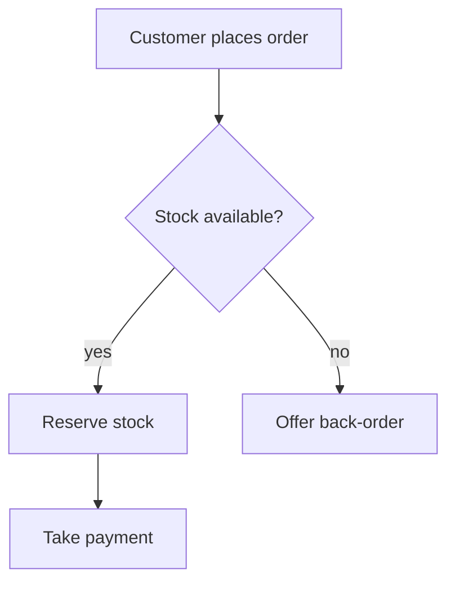

# {{title}}

*Who reads this: business owners, analysts and QA. Started {{date}} by {{author}}.*

## Purpose

*What this flow achieves for the business, and when it starts and ends.*

## Actors

*Each person, team or system that takes part, and what they are responsible for.*

## Preconditions

*What must be true before the flow can start.*

## Flow

*The main path, step by step. Mark the decisions and who makes them.*



## Alternative and exception paths

*What happens when a decision goes the other way, a step fails, or someone cancels.*

## Business rules

*The rules applied along the way, numbered so scenarios and issues can point at them.*

## Postconditions

*What is true when the flow ends, on each path.*

## Scenarios

*One scenario per path, in Given / When / Then, so the flow can be tested as written.*

```gherkin
Feature: Place an order
  Scenario: Stock is available
    Given a customer with an item in the basket
    When they place the order
    Then the stock is reserved
    And payment is requested
```

## Related

*The FSD for the screens involved, the issues that build each step, the test plan that runs these scenarios.*
