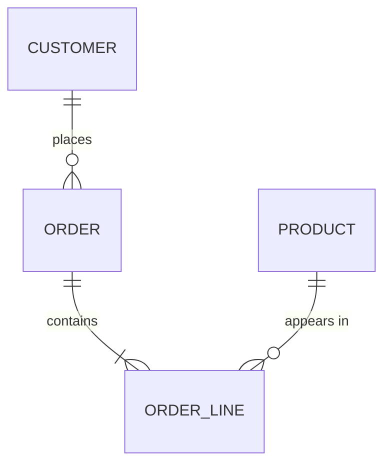

# {{title}}

*Who reads this: engineers, analysts and anyone reporting on the data. Started {{date}} by {{author}}.*

## Overview

*The domain this model covers, and the system that stores it.*

## Entity relationship diagram

## Entities

*For each entity: what it represents, its key, and its important fields.*

| Field | Type | Required | Meaning |
|---|---|---|---|
| *id* | *uuid* | *yes* | *Primary key* |

## Relationships and rules

*Cardinalities, ownership, what may be deleted and what must be kept.*

## Lifecycle and retention

*How long data lives, how it is archived or erased, and why.*

## Sensitive data

*Personal or confidential fields, who may see them, and how they are protected.*

## Related

*The TSD that uses this model, the API contract that exposes it, the FSD screens that show it.*
