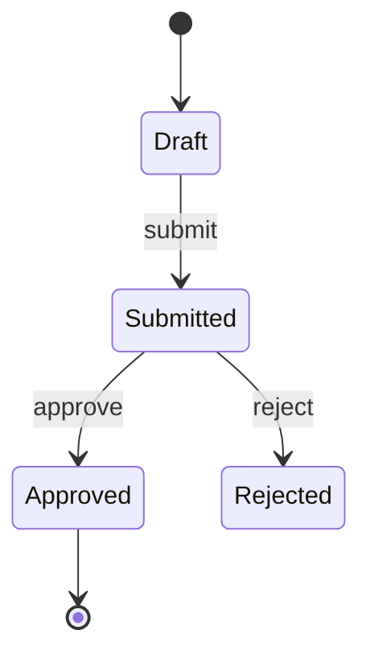

# {{title}}

*Who reads this: developers, testers and designers. Started {{date}} by {{author}}.*

## Overview

*The feature in a paragraph, and the requirements it implements.*

## Actors and permissions

| Actor | Can |
|---|---|
| *Admin* | *Approve, reject, export* |

## Behaviour

*Walk through the feature step by step: what the user does, what the system answers, what it shows.*

## Business rules

| Id | Rule |
|---|---|
| *BR-1* | *An order over the limit needs a second approval* |

## States

*The states a record moves through, and what moves it.*

## Data

*Fields shown or entered, with type, required or not, and validation.*

## Errors and edge cases

*What can go wrong and exactly what the user sees when it does.*

## Related

*The SRS requirements this implements, the business flow it is part of, the issues that build it.*
