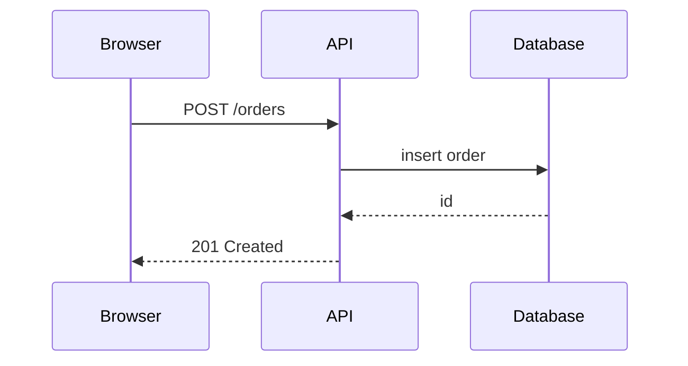

# {{title}}

*Who reads this: engineers and reviewers. Started {{date}} by {{author}}.*

## Context

*What is being built and which requirements drive the design.*

## Architecture

*The components involved and how they talk to each other.*

## Components

*For each component: what it owns, what it exposes, what it depends on.*

## Data

*Storage, schemas and migrations. Point at the data model document for the full picture.*

## Interfaces

*APIs, events and files exchanged. Point at the API contract.*

## Choices and alternatives

*Each significant choice, the options weighed, and why this one. Record lasting ones as ADRs.*

## Security and privacy

*Authentication, authorisation, secrets, personal data, and what an attacker would try.*

## Operations

*Deployment, configuration, monitoring, and what an on-call engineer needs to know.*

## Risks and open questions

*What is uncertain, and how it will be settled.*

## Related

*The SRS and FSD it implements, the ADRs it relies on, the issues that build it.*
